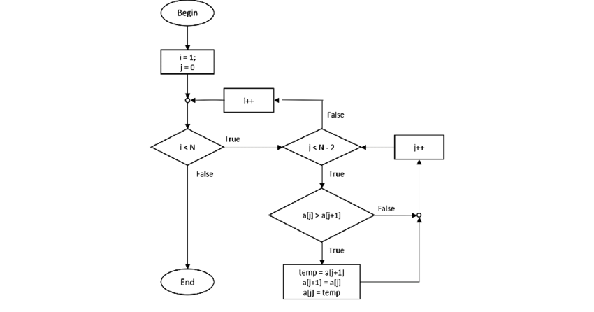

# README: Giải Thích Thuật Toán Bubble Sort

## Giới Thiệu
Thuật toán Bubble Sort là một thuật toán sắp xếp đơn giản. Nó so sánh các cặp phần tử liên tiếp và đổi chỗ chúng nếu không đúng thứ tự. Quá trình này lặp lại cho đến khi không cần đổi chỗ nữa.

## Flowchart



## Pseudocode
```
procedure bubbleSort(A : array)
    n = length(A)
    for i = 0 to n-1
        for j = 0 to n-i-2
            if A[j] > A[j+1]
                swap A[j] và A[j+1]
            end if
        end for
    end for
end procedure
```

## Minh Họa


## Kết Luận
Bubble Sort dễ hiểu nhưng không hiệu quả cho dữ liệu lớn. Tuy nhiên, nó giúp hiểu về thuật toán sắp xếp.
